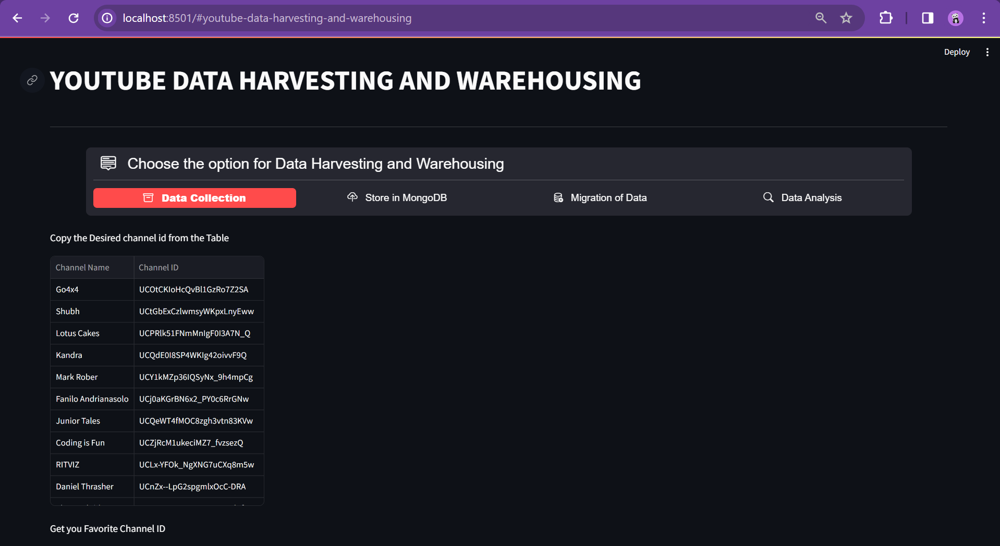
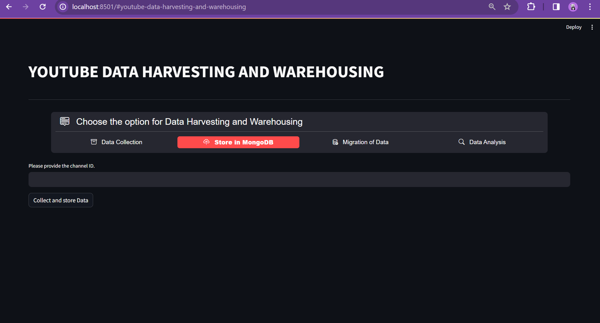
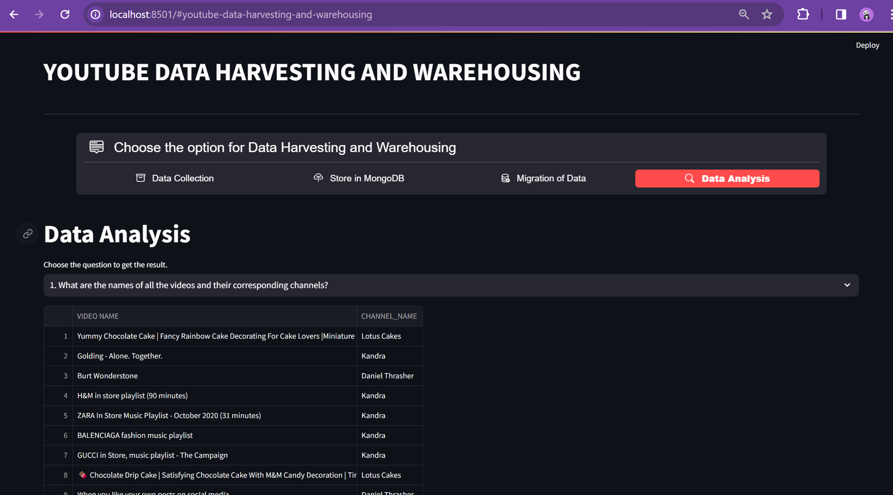

# capstone1
Jeriyl-capstone1 Project

# To create a virtual environment
python -m venv venv

# To activate the virtual environment
.\venv\Scripts\Activate.ps1

# To Install the required packages
pip install requirements.txt

# To run the application
streamlit run capstone1.py

Screenshots from project:

